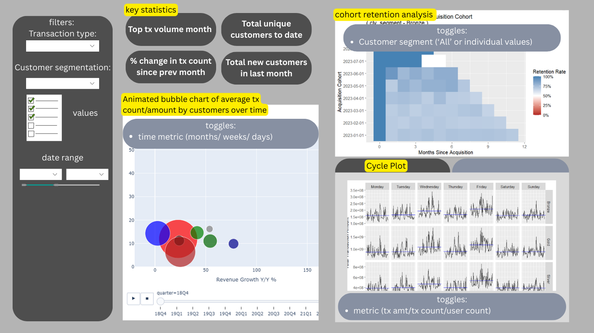
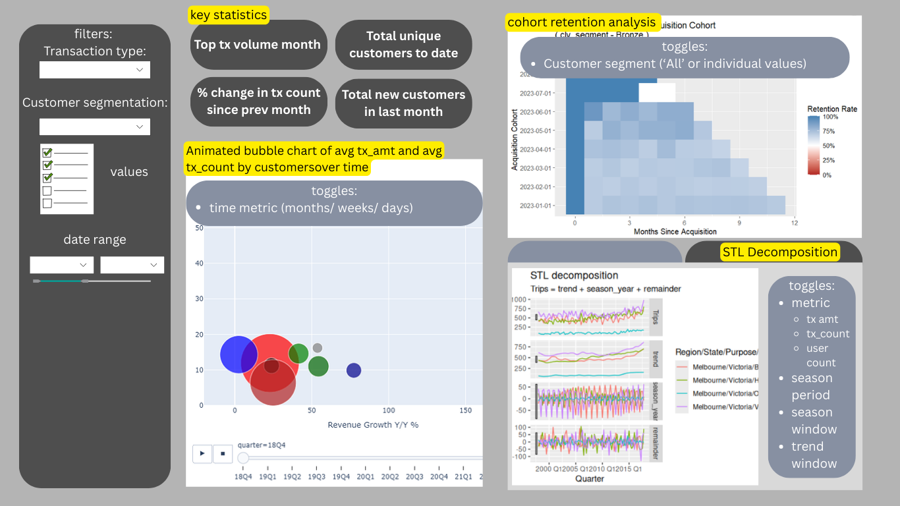
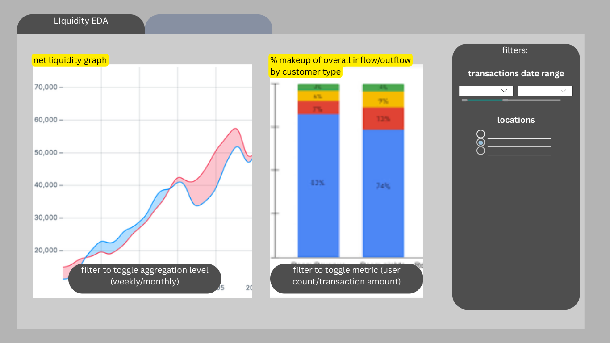
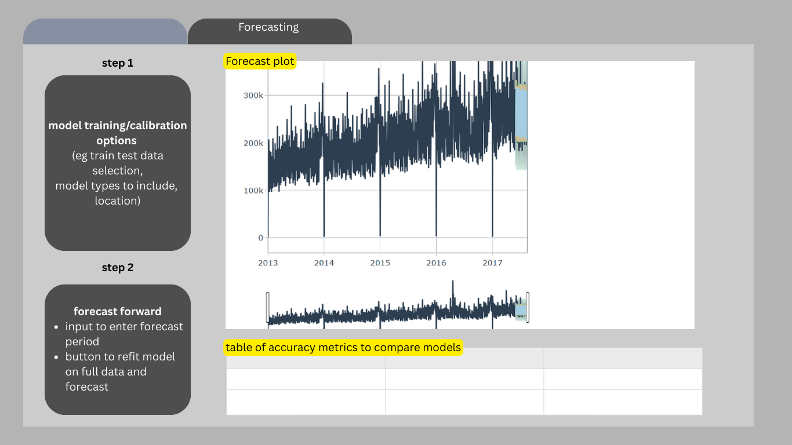
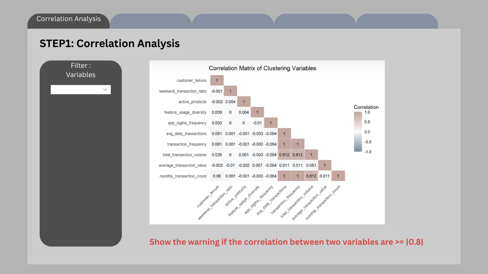
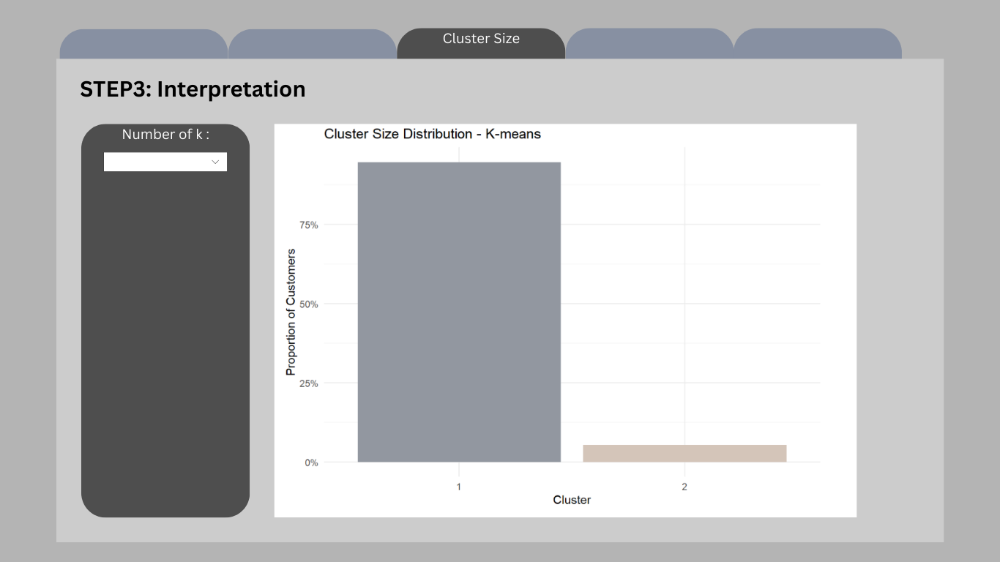
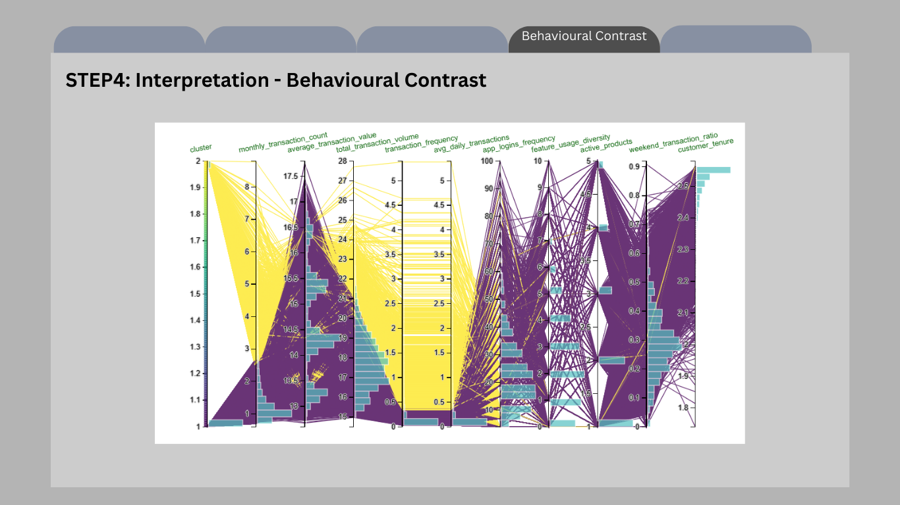
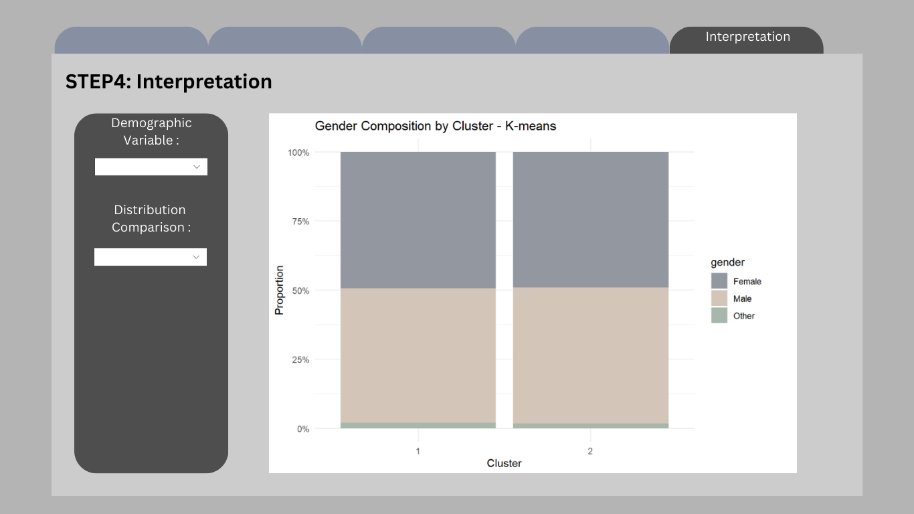

## Overview

The proposed layout for the individual modules of the Shiny App are as follows:

## Time-Oriented Data Analysis

The following images demonstrate the planned layout for the module, which will consist of two main pages:

1.  **Dashboard** - Explore the transaction behaviour of customers over time

2.  **Cashflow analysis** - Explore past trends in net cashflow based on customer transactions and forecast future cashflow

### Dashboard

The dashboard will consist of 5 main sections.

1.  General Filters - These will manipulate dataset that the figures and graphs are based on, allowing users to focus on specific subsections of data they are interested in such.

2.  Key statistics - This will highlight some key statistics from the subset of data being analysed

3.  Animated bubble chart - This will allow users to understand visualise how the distribution of customers according to the selected segmentation variable and the average transaction behaviour of customers within each segment has changed over time.

4.  Cohort retention heatmap - This allows customers to visualise the percentage of returning customers making transactions from each monthly cohort of new customers.

5.  Cycle Plot/STL Decomposition plot - These allow the users to explore possible seasonal/cyclical patterns in transaction behaviour

### Cashflow Analysis

The first tab of the cashflow analysis consists of two graphs. The first graph plots the amounts of cash inflow/outflow based on the transaction data, and produces a color-coded shaded area representing net inflow or net outflow. The second graph breaks down inflow and outflow contributions by customer segment.

The second tab of the cashflow analysis provides a simple user interface for users to train and test various forecasting models to predict upcoming cashflow.

## Clustering and Customer Profiling Analysis

The following images demonstrate the planned layout for the module, which is designed to help users identify meaningful customer segments based on transaction behaviour and customer characteristics.

The module will consist of two main pages:

1.  **Clustering Dashboard** - Explore the clustering workflow, including variable screening, clustering method selection, cluster size assessment, and behavioural contrast across clusters

2.  **Cluster Profiling** - Explore the demographic composition of the resulting clusters and support business interpretation of customer segments

### Clustering Dashboard

The dashboard will consist of 4 main sections.

**Correlation Analysis** - This allows users to examine the relationships between candidate clustering variables before segmentation is performed. A correlation matrix will be used to highlight highly correlated variables that may introduce redundancy into the clustering model. A warning message will also be shown when the absolute correlation between two variables exceeds a predefined threshold.

**Clustering Method Selection** - This allows users to compare different clustering methods, such as K-means, PAM, and GMM. Evaluation plots such as the Elbow plot and the BetweenSS / TotalSS ratio plot will help users determine an appropriate number of clusters. Explanatory text will also be provided to guide users in interpreting the diagnostic plots.

**Cluster Size Distribution** - This allows users to assess how customers are distributed across the selected clusters. The visualisation will show the proportion of customers in each cluster, helping users evaluate whether the segmentation result is balanced and practically interpretable.

**Behavioural Contrast** - This allows users to compare clusters across selected behavioural variables. A parallel coordinate plot will be used to highlight differences in transaction frequency, transaction value, app engagement, product usage, and other clustering variables, so that users can better understand the behavioural patterns of each customer segment.

### Cluster Profiling

**Demographic Composition** - This allows users to compare the demographic composition of each cluster using selected customer characteristics such as gender, age group, or occupation. A proportion-based chart will be used to show whether certain customer groups are more heavily represented in specific clusters, thereby supporting interpretation and customer profiling.

